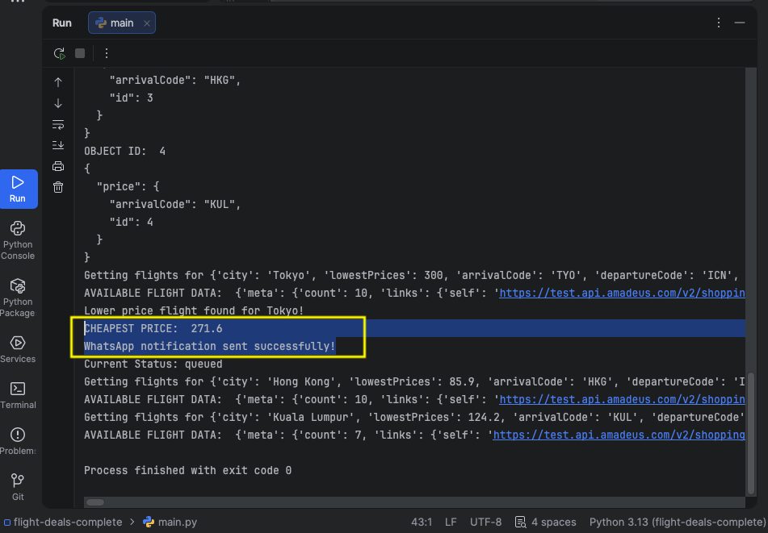

## Demo Video
https://drive.google.com/file/d/1yynhKGnXvmSCxiyDp9d0wAqNlKQh2OBr/view?usp=drive_link 

## APIs Required

Google Sheet Data Management - https://sheety.co/

Amadeus Flight Search API (Free Signup, Credit Card not required) - https://developers.amadeus.com/

Amadeus Flight Offer Docs - https://developers.amadeus.com/self-service/category/flights/api-doc/flight-offers-search/api-reference

Amadeus How to work with API keys and tokens guide - https://developers.amadeus.com/get-started/get-started-with-self-service-apis-335

Amadeus Search for Airport Codes by City name - https://developers.amadeus.com/self-service/category/destination-experiences/api-doc/city-search/api-reference

Twilio Messaging (SMS or WhatsApp) API - https://www.twilio.com/docs/messaging/quickstart/python

## How It Works

1. This app uses the Flight Search and Sheety API to populate your own copy of the Google Sheet with International Air Transport Association (IATA) codes for each city. Most of the cities in the sheet include multiple airports, you want the city code (not the airport code see here).

2. Flight Search API is used to check for the cheapest flights from tomorrow to 6 months later for all the cities and logs the data in your Spreadsheet.

3. Later on, if the app finds a lower price than the lowest price listed in the Google Sheet then it sends an SMS (or WhatsApp Message) to your own number using the Twilio API.

4. The SMS includes the departure airport IATA code, destination airport IATA code, flight price and flight dates etc.

## Visual Description for How It Processes

1. First, set the price cap. (as described on the image) If there are no flight tickets found below the price cap amount, Whatsapp notification is not sent.

2. If it found the cheapest price ticket below the price cap, it displays the found price and success message of Whatsapp notification during the runtime

3. On the Whatsapp message, an alert is received that contains the price, departure/arrival airports, and departure/return date.